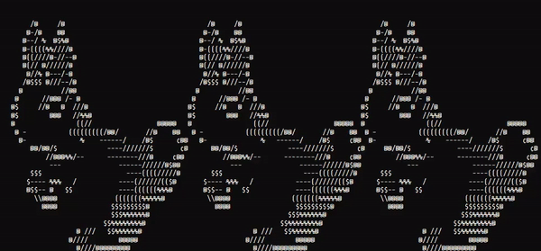

    
    <h1>👋 Hello, there! </h1>
    

        My name is Glass. I'm a computational physicist and scientific software engineer  
        with a focus in data analysis, and a passion for open science and open source projects.    
    

  

 

### 🔭 I’m currently working on

| Project | Last Commit | Description | 
|---|:-:|---| 
| [neutrons/RefRed](https://github.com/neutrons/RefRed) | 2 days ago | Data Reduction Software for the Liquids Reflectometer | 
| [reflectometry/refl1d](https://github.com/reflectometry/refl1d) | 2 days ago | 1-D reflectometry fitting | 
| [glass-ships/glass-fish](https://github.com/glass-ships/glass-fish) | 6 days ago | Custom fish fish environment with a (kinda) pretty prompt, and some convenience aliases and functions. | 
| [glass-ships/homepage](https://github.com/glass-ships/homepage) | 1 week ago |  | 
| [glass-ships/glass-bash](https://github.com/glass-ships/glass-bash) | 1 week ago |  | 

### 🚀 Recent releases I contributed to

| Project | Latest Release| Description |
|---|:-:|---| 
| [monarch-initiative/biogrid-ingest](https://github.com/monarch-initiative/biogrid-ingest) | [2024-11-05](https://github.com/monarch-initiative/biogrid-ingest/releases/tag/2024-11-05) | BioGRID ingest | 
| [mantidproject/mantid](https://github.com/mantidproject/mantid) | [v6.11.20241113.1518](https://github.com/mantidproject/mantid/releases/tag/v6.11.20241113.1518) | Main repository for Mantid code | 
| [bumps/bumps](https://github.com/bumps/bumps) | [v1.0.0a8](https://github.com/bumps/bumps/releases/tag/v1.0.0a8) | Data fitting with uncertainty analysis | 
| [monarch-initiative/kghub-downloader](https://github.com/monarch-initiative/kghub-downloader) | [v0.3.11](https://github.com/monarch-initiative/kghub-downloader/releases/tag/v0.3.11) | Configuration based file caching downloader | 
| [monarch-initiative/ncbi-gene](https://github.com/monarch-initiative/ncbi-gene) | [2024-11-03](https://github.com/monarch-initiative/ncbi-gene/releases/tag/2024-11-03) |  | 

### 🌱 I’m currently learning
- Front End development w/ TypeScript and Vue/React
- Quantum Computing with Qiskit
- Rust

### 👯 I’m looking to collaborate on
- Physics research
- AI/Machine learning and Quantum computing
- Research experiments with software infrastructure needs

 

## 💻 Tools & Languages  

##

## 

 

    
     
    
    

## 🎓 Certificates & Trainings

 

🧿
